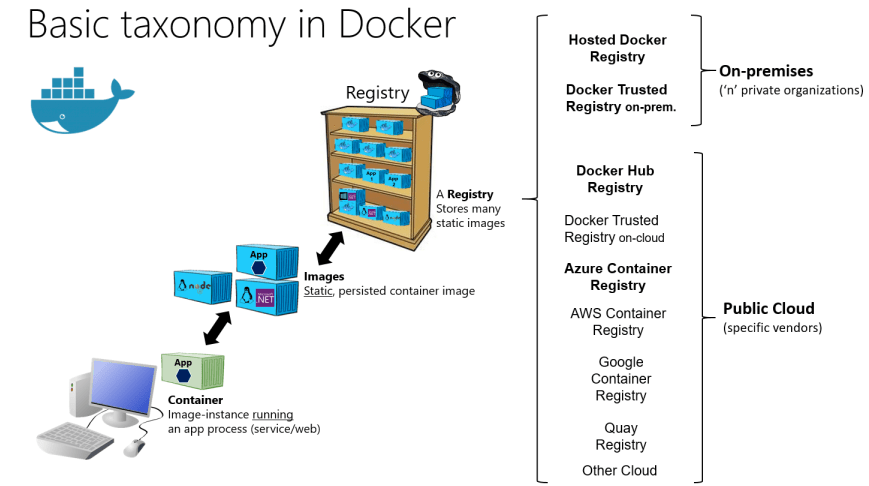

# Flask API Docker - Practice

A hands-on exercise to implement Docker


## Docker Terminology
1. Docker Daemon: Runs on host machine, creates and manages docker objects such as images, containers, network, volume, data, etc.
2. Docker Image: A package with all the dependencies and information needed to create a container.
3. Container: A running instance of an image.
4. Docker Hub: A service which we can share image with the team or the public and also it is a repository to store images.
5. Dockerfile: A set of commands executed sequentially to create an image.



source: https://dev.to/ankushsinghgandhi/docker-cheat-sheet-56cc


## Steps
Build the Docker image
```bash
docker build -t simple-flask-api .
```

`-t` means we provide a flag tag to the image.

`.` means Docker should refer to the `Dockerfile` in the current directory.


Run the Docker container
```bash
docker run -d -p 5000:5000 simple-flask-app
```

`-d` means we running the container in "detached" mode (in the background).

`-p` means we creating a mapping between the host's port 5000 to the container's port 5000.
If we don't do the port mapping, we can't access the app.

Once the Docker container is running, we can access it in the web browser http://localhost:5000/.


Happy coding!

_________________________________________________
# Docker Compose

Make sure you have done:
```
git checkout compose
```

Docker Compose reference:
https://docs.docker.com/compose/compose-file/compose-file-v3/

## Run docker compose
### Development environment
----

Image run:
```
docker-compose up
```
There are several things happen:

1. `docker-compose` automatically creates images of `webapp` by building it from the context and dockerfile attribute
2. names the newly created image to: `<parent folder name>_<servicename>`. In this example: `simple-flask_webapp`
3. `docker-compose` runs `webapp` service with it's `CMD` attribute in `Dockerfile` or `command` attribute in `docker-compose`
4. `docker-compose` attaches container's `5000` port to host's `5000` port

You can

`docker-compose up`

is similar to 
`docker build -t simple-flask_webapp .`

`docker run simple-flask_webapp`

----
### Production Environment
----
In Production environment, we shouldn't copy our code base. We should only pull and run docker images.

In this case, the provided `docker-compose.prod.yml` extends the default `docker-compose.yml`. 

It consists of the attributes that can extend the current `webapp` service (notice the same service name `webapp`)

to run it:
```
docker-compose -f docker-compose.yml -f docker-compose.prod.yml up
```

by default `docker-compose` reads `docker-compose.yml`. To extend it, we need to explicitly tells which `yml` file it needs to read with `-f` arguments. 

There are several things happen:
1. Pulls `simple-flask-api` image if it doesn't exist yet.
2. Attaches `5000` port to host's `80` port
3. Runs `simple-flask-api`'s command
 
## Network connection within `docker-compose.yml` services

Make sure you have done:
```
git checkout volumes-network
```

to run:
```
docker-compose -f docker-compose.yml -f docker-compose.text.yml up --build
```

to stop:
```
docker-compose -f docker-compose.yml -f docker-compose.text.yml down -v   
```


 You can access another container api with it's service name in the same `docker-compose.yml` file [(Reference)](https://docs.docker.com/compose/networking/)

Take a look on `docker-compose.text.yml`. There is additional service called `text`, builds on `Dockerfile_text` which runs `app_text.py`. 

simply said, if you call `http://text:5000/read`, you can reach the `text` service without having to define the IP and etc.

### How does it work?
Compose automatically create docker network within docker-compose's services.
You can however manually renaming the network and/or add external network. [Reference](https://docs.docker.com/compose/networking/#)

## Volume linking

The `text` service manages the text contents of `/text_dir/text.txt` through it's own api.

while `webapp` service doesn't have any access to `text` file contents unless it's linked in `docker-compose` with the attribute `volumes`.

In the example in `docker-compose.text.yml` we create a new docker volume called `text_volume` which is populated by `text` service (because `text` service's workdir in that directory) 


